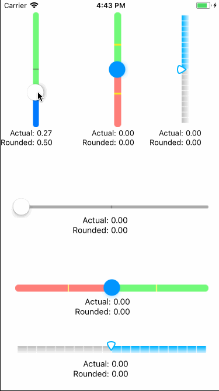
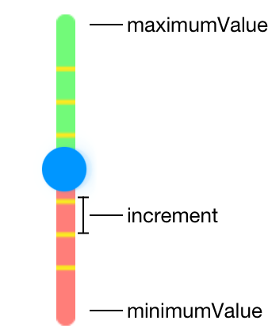
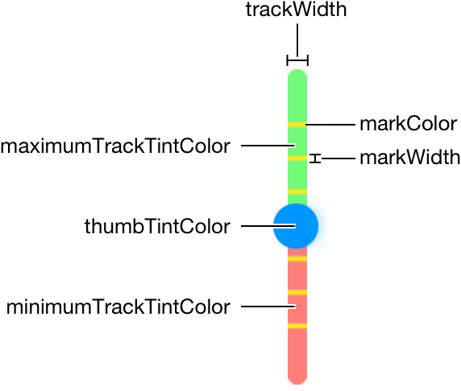
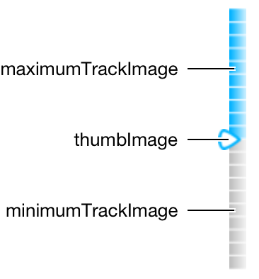
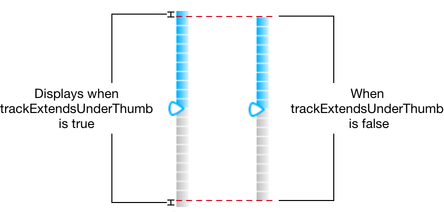

# VerticalSteppedSlider

[](https://travis-ci.org/mludowise/VerticalSteppedSlider)
[](http://cocoapods.org/pods/VerticalSteppedSlider)
[](http://cocoapods.org/pods/VerticalSteppedSlider)
[](http://cocoapods.org/pods/VerticalSteppedSlider)

## Introduction

`VerticalSteppedSlider` is a completely configurable slider for iOS written in Swift. Configure custom track widths, colors, or images, set the size of the step inrements as well as vertical orientation.

## Demo



To run the example project, clone the repo, and run `pod install` from the Example directory first.

## Installation

VerticalSteppedSlider is available through [CocoaPods](http://cocoapods.org). To install
it, simply add the following line to your Podfile:

```ruby
pod 'VerticalSteppedSlider'
```

## Usage

Firstly, import `VerticalSteppedSlider`.
```swift
import VerticalSteppedSlider
```

### Initialization

There are two ways to create a VSSlider:
* In the storyboard, change the class of a UIView to `VSSlider` and set the module to `VerticalSteppedSlider`.
* In code using an `init(frame:CGRect)`

### Using Increments

The property `increment` determines where the marks will be drawn on the slider and will round the value to the nearest increment after sliding the slider.



For example, if the minimumValue is -1, maximumValue is 1, and increment is 0.5, the a mark will be drawn at -0.5, 0, and 0.5. Likewise, the slider will only allow the values -1, -0.5, 0, 0.5, and 1 when sliding the slider.

### Customizing the Slider’s Appearance

If you want to change the colors of the track and thumb, you can set custom tint colors for both the track and the thumb of a slider, using the `minimumTrackTintColor`, `maximumTrackTintColor`, `markColor`, and `thumbTintColor` properties. You can also specify the thickness of the track with `trackWidth` and the weight of the increment marks with `markWidth`. By default, the minimum track tint color defers to the tint color of the slider control.



You can more finely control the appearance of the slider by specifying the images used to draw the thumb and the track.



The `trackExtendsUnderThumb` property determines the length of the track. By default, the slider tracks extend before the `minimumValue` and after the `maximumValue` in order to make the thumb align with the beginning and end of the slider. This matches the default behavior of Apple's `UISlider` To turn this off and view a more accurate slider, set `trackExtendsUnderThumb` to false.



### Properties

| Topic | Property      | Description                       | Type        | Default Value |
|-------|---------------|------------------------------|------------|----------------|
| **Accessing the Slider’s Value** | `value` | Current raw value of the slider, not rounded to the nearest the increment. See UISlider.value for more information. | `Float` | `0` |
| | `roundedValue` | Computed property that returns the value rounded to the nearest increment. | `Float` | |
| **Accessing the Slider’s Value Limits** | `minimumValue` | See `UISlider.minimumValue` for more information. | `Float` | `0` |
| | `maximumValue` | See `UISliuder.maximumValue` for more information. | `Float` | `1` |
| | `increment` | The step increment for the slider. Set to 0 if the slider should be smooth and not round to the nearest increment. | `Float` | `0.5` |
| **Modifying the Slider’s Behavior** | `isContinuous` | A Boolean value indicating whether changes in the slider’s value generate continuous update events. See [`UISlider.isContinuous`.](https://developer.apple.com/documentation/uikit/uislider/1621340-iscontinuous) | `Bool` | `true` |
| **Changing the Slider’s Appearance** | `vertical` | If orientation of slider should be vertical or horizontal. | `Bool` | `true` |
| | `ascending` | Ascending is defined as: <ul><li>Min on the left and max on the right when horizontal in left-to-right localized layouts.</li><li>Min on the right and max on the left when horizontal in right-to-left localized layouts.</li><li>Min on top and max on the bottom when vertical</li></ul> | `Bool` | `false` |
| | `trackWidth` | The thickness of the slider track in points. | `CGFloat` | `2` |
| | `trackExtendsUnderThumb` | Defines if the track should be slightly wider than its min and max values to accomodate for the width of the slider thumb. The value "true" replicates the behavior of UISlider but the increment marks will appear as though there is more space between the first and last marks and the ends of the slider. | `Bool` | `true` |
| | `markWidth` | The thickness of the increment marks on the slider in points. | `CGFloat` | `1` |
| | `markColor` | Color of the marks of the slider. | `UIColor` | `darkGray` |
| | `minimumTrackTintColor` | The color used to tint the default minimum track images. If `minimumTrackImage` is non-nil, this is ignored. See [`UISlider.minimumTrackTintColor`](https://developer.apple.com/documentation/uikit/uislider/1621348-minimumtracktintcolor) for more information. | `UIColor?` | `nil` |
| | `minimumTrackImage` | Assigns a minimum track image to the specified control states. Setting this image, calls `setMinimumTrackImage()` on the internal `UISlider` for the `.normal` state. If non-nil, overrides `minimumTrackTintColor`. See [Apple's Customizing the Slider’s Appearance](https://developer.apple.com/documentation/uikit/uislider#1653132) for more information. | `UIImage?` | `nil` |
| | `maximumTrackTintColor` | The color used to tint the default maximum track images. If `minimumTrackImage` is non-nil, this is ignored. See [`UISlider.minimumTrackTintColor`](https://developer.apple.com/documentation/uikit/uislider/1621334-maximumtracktintcolor) for more information. | `UIColor?` | `nil` |
| | `maximumTrackImage` | Assigns a maximum track image to the specified control states. Setting this image, calls `setMaximumTrackImage()` on the internal `UISlider` for the `.normal` state. If non-nil, overrides `maximumTrackTintColor`. See [Apple's Customizing the Slider’s Appearance](https://developer.apple.com/documentation/uikit/uislider#1653132) for more information. | `UIImage?` | `nil` |
| | `thumbTintColor` | The color used to tint the default thumb images. If `thumbImage` is non-nil, this is ignored. See [`UISlider.thumbTintColor`](https://developer.apple.com/documentation/uikit/uislider/1621332-thumbtintcolor) for more information. | `UIColor?` | `nil` |
| | `thumbImage` | Assigns a thumb image to the specified control states. If non-nil, overrides `thumbTintColor`. See [Apple's Customizing the Slider’s Appearance](https://developer.apple.com/documentation/uikit/uislider#1653132) for more information. | `UIImage?` | `nil` |

## License

VerticalSteppedSlider is available under the MIT license. See the LICENSE file for more info.
